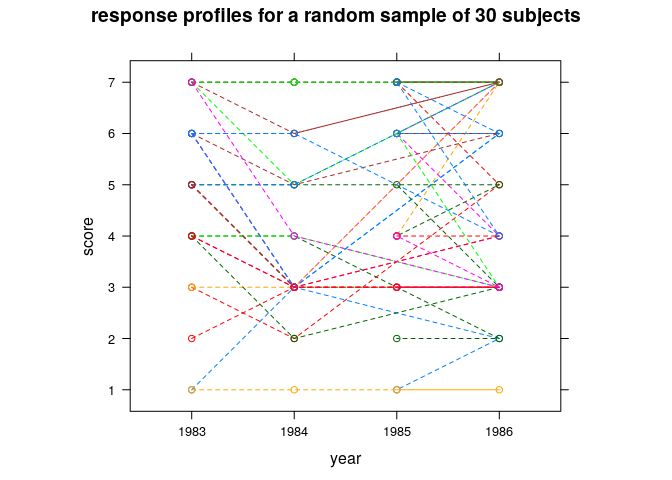

# Introduction

Exploratory data analysis is a crucial first step in answering a scientific question. In this document I provide some examples of how to dynamically include figures in reports. Several figure chunk options that \texttt{knitr} [@k1;@k2;@k3] provides are discussed. We illustrate these options along with the plotting capabilities of \texttt{ggplot2}~\citep{ggplot2} and \texttt{lattice} [@lattice]. The data come from part of an investigation of British Social Attitudes (BSA) Survey [@mcgrath1986british] started in 1983. Every participant was asked whether they supported or opposed a woman's right to have an abortion under seven different circumstances each year from 1983 to 1986. We are interested in assessing the impact of gender, age, self assessed social class, political party, and religion on one's attitude towards abortion, and find out what are the main factors that affect people's attitude towards abortion.  We are also interested in assessing whether people's attitude towards abortion have changed over the years, and whether these changes are due to time or the change of some other factors.  

<br>


# Background

The respondents were asked if they supported or opposed a woman's right to have an abortion under seven different circumstances.   The same seven circumstances were presented in each of the four years of the study, and show different situations. A higher score indicates a more positive attitude towards abortion. The seven circumstances are as follows:  

1. The woman decides on her own she does not wish to have the child.  
2. The couple agree they do not wish to have the child.  
3. The woman is not married and does not wish to marry the man.  
4. The couple cannot afford any more children.  
5. There is a strong chance of a defect in the baby.  
6. The woman's health is seriously endangered by the pregnancy.  
7. The woman became pregnant as a result of rape.  


# Exploratory Analysis


Figure \@ref(fig:figure-1) shows the response by each variable, ignoring the repeated measurement structure in the data set.  The plot of response by age suggests that the association between the response and age is not linear.  Basically, younger group tends to have higher scores than older group.  We also see a big drop in positive attitudes towards abortion in 1984 and then an increase in subsequent years.  There also seems to be quite a bit of variability in the scores as a function of religion.  No difference was observed between males and females, between political party or social class.

<div class="figure" style="text-align: center">

<p class="caption">(\#fig:figure-1)The response by each variable, ignoring the repeated measurement structure in the data set</p>
</div>


The Figure below shows the observed response profiles of a random sample of 30 subjects (Figure \@ref(fig:figure-21) with the corresponding OLS fits (Figure \@ref(fig:figure-22) as a function of year.  Much variation can be observed in the initial scores, but on average, the scores decrease from 1983 to 1984, and then increase in the last two years.   We should keep in mind that there are some ties in the plot.

<div class="figure">

<p class="caption">(\#fig:figure-21)Selected individual score profiles from the British Social Attitudes (BSA) Survey. Scores for a random sample of 30 subjects.</p>
</div><div class="figure">

<p class="caption">(\#fig:figure-22)Least squares fits (with year) for same random sample of 30</p>
</div>

In Figures \@ref(fig:figure-31), \@ref(fig:figure-32) and \@ref(fig:figure-33) we present the densities of the response by year and political party, self assessed social class and religion, respectively.  Figure \@ref(fig:figure-31) does not show any noticeable change across time and political party though there is an empty cell in 1986.  In Figure \@ref(fig:figure-32), we observe lower scores in 1984, but the pattern across years and social classes looks similar.  Considering Figure \@ref(fig:figure-33), those subject who did not identify with a particular religion tended to answer more positively toward abortion when compared to those subject who were religious. This difference was consistent across all years of the study. 

<div class="figure" style="text-align: center">

<p class="caption">(\#fig:figure-31)Histogram of responses, stratified by year and political party</p>
</div><div class="figure" style="text-align: center">

<p class="caption">(\#fig:figure-32)The response by year and SES</p>
</div><div class="figure" style="text-align: center">

<p class="caption">(\#fig:figure-33)The response by year and religion</p>
</div>


We plot answers as a function of age (Figure \@ref(fig:figure-61)) with a loess smoothed line (Figure \@ref(fig:figure-62)) 

<div class="figure" style="text-align: center">

<p class="caption">(\#fig:figure-61)Answers vs. Age</p>
</div><div class="figure" style="text-align: center">

<p class="caption">(\#fig:figure-62)Answers vs. Age</p>
</div>


<br>


# Code {-}


```r
if (!require("pacman")) install.packages("pacman")
pacman::p_load(knitr, here)  # needed for filepaths

options(width = 60, digits = 2)
set.seed(45)
opts_chunk$set(echo = FALSE, tidy = TRUE, cache = FALSE, warning = FALSE, 
    message = FALSE)
opts_template$set(fig.large = list(fig.width = 7, fig.height = 5, 
    fig.align = "center", fig.pos = "H"), fig.small = list(fig.width = 6, 
    fig.height = 4, fig.align = "center", fig.pos = "H"), fig.full = list(fig.width = 8, 
    fig.height = 6, fig.align = "center", fig.pos = "H"))
opts_knit$set(eval.after = "fig.cap")  # for captions to be evaluated after R objects are available 

knitr::read_chunk(here::here("R", "004-packages.R"))
knitr::read_chunk(here::here("R", "004-analysis.R"))
plot(DT$age, DT$answers)
lines(stats::lowess(DT$age, DT$answers), col = "red", lwd = 3)
print(sessionInfo(), locale = FALSE)
if (!require("pacman")) install.packages("pacman")

pacman::p_load(knitr, here, xtable, lattice, ggplot2, dplyr, 
    data.table, bookdown)
multiplot <- function(..., plotlist = NULL, file, cols = 1, layout = NULL) {
    require(grid)
    
    # Make a list from the ... arguments and plotlist
    plots <- c(list(...), plotlist)
    
    numPlots = length(plots)
    
    # If layout is NULL, then use 'cols' to determine layout
    if (is.null(layout)) {
        # Make the panel ncol: Number of columns of plots nrow:
        # Number of rows needed, calculated from # of cols
        layout <- matrix(seq(1, cols * ceiling(numPlots/cols)), 
            ncol = cols, nrow = ceiling(numPlots/cols))
    }
    
    if (numPlots == 1) {
        print(plots[[1]])
        
    } else {
        # Set up the page
        grid.newpage()
        pushViewport(viewport(layout = grid.layout(nrow(layout), 
            ncol(layout))))
        
        # Make each plot, in the correct location
        for (i in 1:numPlots) {
            # Get the i,j matrix positions of the regions that contain
            # this subplot
            matchidx <- as.data.frame(which(layout == i, arr.ind = TRUE))
            
            print(plots[[i]], vp = viewport(layout.pos.row = matchidx$row, 
                layout.pos.col = matchidx$col))
        }
    }
}
dat <- read.table(here::here("data", "SOCATT.DAT"), colClasses = c("factor", 
    "factor", "numeric", "numeric", "numeric", "numeric", "numeric", 
    "numeric", "numeric"))
# dat <- read.table('SOCATT.DAT', colClasses=c('factor',
# 'factor', 'numeric', 'numeric', 'numeric', 'numeric',
# 'numeric', 'numeric', 'numeric'))
colnames(dat) <- c("Districts", "Subject", "Year", "Score", "Party", 
    "SocialClass", "Gender", "Age", "Religion")
dat$Age_Cur <- dat$Age + dat$Year - 1
dat$Year <- as.factor(dat$Year + 1982)
dat$Gender <- factor(dat$Gender, labels = c("Male", "Female"))
dat$Party <- factor(dat$Party, labels = c("Conserv", "Labour", 
    "Liberal", "Other", "None"))  # Liberal* = Liberal/SDP/Alliance
dat$Religion <- factor(dat$Religion, labels = c("Catholic", "Protestant", 
    "Other", "None"))
dat$SocialClass <- factor(dat$SocialClass, labels = c("Middle", 
    "Upper", "Lower"))
DT <- as.data.table(read.table(here::here("data", "SOCATT.DAT")))
# DT <- as.data.table(read.table('SOCATT.DAT'))
setnames(DT, c("District", "id", "year", "answers", "party", 
    "ses", "sex", "age", "religion"))
DT[, `:=`(party = factor(ifelse(party == 1, "Conserv", ifelse(party == 
    2, "Labour", ifelse(party == 3, "Liberal", ifelse(party == 
    4, "Other", "None"))))), answers.f = factor(answers, ordered = TRUE), 
    ses = ifelse(ses == 1, 2, ifelse(ses == 2, 3, 1)), sex = factor(ifelse(sex == 
        1, "Male", "Female")), religion = factor(ifelse(religion == 
        1, "Catholic", ifelse(religion == 2, "Protestant", ifelse(religion == 
        3, "Other", "None")))), year = ifelse(year == 1, 1983, 
        ifelse(year == 2, 1984, ifelse(year == 4, 1985, 1986))))]
DT[, `:=`(ses = factor(ifelse(ses == 1, "lower", ifelse(ses == 
    2, "middle", "upper")), ordered = T))]
g1 <- ggplot(data = dat, aes(x = Year, y = Score)) + geom_boxplot() + 
    ggtitle("Scores with different years")  # http://en.wikipedia.org/wiki/The_Silent_Scream
g2 <- ggplot(data = dat, aes(x = Gender, y = Score)) + geom_boxplot() + 
    ggtitle("Scores with different gender")  # + facet_grid(. ~ Year) 
g3 <- ggplot(data = dat, aes(x = Age, y = Score)) + geom_point() + 
    geom_smooth(aes(group = 1), method = "loess", size = 2) + 
    ggtitle("Scores with different baseline ages") + xlab("Current Age")  #  + facet_grid(. ~ Gender)
g4 <- ggplot(data = dat, aes(x = Party, y = Score)) + geom_boxplot() + 
    ggtitle("Scores with different parties")  # + facet_grid(. ~ Year)  + theme(axis.text.x = element_text(angle = 90, hjust = 1)) 
g5 <- ggplot(data = dat, aes(x = SocialClass, y = Score)) + geom_boxplot() + 
    ggtitle("Scores with different slcoal classes")  # + facet_grid(. ~ Year) + theme(axis.text.x = element_text(angle = 90, hjust = 1)) 
g6 <- ggplot(data = dat, aes(x = Religion, y = Score)) + geom_boxplot() + 
    ggtitle("Scores with different religions")  # + facet_grid(. ~ Year) + theme(axis.text.x = element_text(angle = 90, hjust = 1)) 
multiplot(g1, g2, g3, g4, g5, g6, cols = 2)
set.seed(123455)
sample.id <- sample(unique(DT$id), 30)
xyplot(answers ~ factor(year), group = id, data = DT[id %in% 
    sample.id], type = c("l", "p"), lty = 2, xlab = "year", ylab = "score", 
    aspect = "xy", main = "response profiles for a random sample of 30 subjects")
xyplot(answers ~ factor(year), group = id, data = DT[id %in% 
    sample.id], type = c("r"), aspect = "xy", xlab = "year", 
    ylab = "score", index.cond = function(x, y) coef(lm(y ~ x))[1], 
    main = "Least squares fits (with year) for the same random sample of 30 subjects")
m <- ggplot(DT, aes(x = answers))

m + geom_histogram(aes(y = ..density..), binwidth = 1, colour = "darkgreen", 
    fill = "white") + facet_grid(party ~ year) + labs(title = "Response by year and political party")

m + geom_histogram(aes(y = ..density..), binwidth = 1, colour = "darkgreen", 
    fill = "white") + facet_grid(ses ~ year) + labs(title = "Response by year and SES")

m + geom_histogram(aes(y = ..density..), binwidth = 1, colour = "darkgreen", 
    fill = "white") + facet_grid(religion ~ year) + labs(title = "Response by year and religion")
```

# Session Information


```
## R version 3.6.0 (2019-04-26)
## Platform: x86_64-pc-linux-gnu (64-bit)
## Running under: Pop!_OS 18.10
## 
## Matrix products: default
## BLAS:   /usr/lib/x86_64-linux-gnu/blas/libblas.so.3.8.0
## LAPACK: /usr/lib/x86_64-linux-gnu/lapack/liblapack.so.3.8.0
## 
## attached base packages:
## [1] grid      stats     graphics  grDevices utils    
## [6] datasets  methods   base     
## 
## other attached packages:
## [1] bookdown_0.9      data.table_1.12.0 dplyr_0.8.0.1    
## [4] ggplot2_3.1.0     lattice_0.20-38   xtable_1.8-4     
## [7] here_0.1          knitr_1.22        pacman_0.5.0     
## 
## loaded via a namespace (and not attached):
##  [1] Rcpp_1.0.1       formatR_1.6      compiler_3.6.0  
##  [4] pillar_1.3.1     plyr_1.8.4       highr_0.8       
##  [7] tools_3.6.0      digest_0.6.18    evaluate_0.13   
## [10] tibble_2.1.1     gtable_0.2.0     pkgconfig_2.0.2 
## [13] rlang_0.3.4      yaml_2.2.0       xfun_0.6        
## [16] withr_2.1.2      stringr_1.4.0    rprojroot_1.3-2 
## [19] tidyselect_0.2.5 glue_1.3.1       R6_2.4.0        
## [22] rmarkdown_1.12   reshape2_1.4.3   purrr_0.3.2     
## [25] magrittr_1.5     backports_1.1.3  scales_1.0.0    
## [28] htmltools_0.3.6  assertthat_0.2.1 colorspace_1.4-0
## [31] labeling_0.3     stringi_1.4.3    lazyeval_0.2.1  
## [34] munsell_0.5.0    crayon_1.3.4
```


# References

