# Introduction

Often in statistics, we are required to perform sensitivity analyses to see the effect of parameters on inference. Here I provide a simple illustration of performing such a task in an efficient and reproducible way using the function \texttt{knitr::knit\_expand} [@k1;@k2;@k3]. We use the demonstration of the Central Limit Theorem (CLT) in action [@joseph] as an example.

<br>


# Lawrence Joseph's Trip to Purvis Hall


<br>


# Proof of CLT in Action with \texttt{R} and \texttt{knitr::knit\_expand}


La somme de 1 a 10 egale a 1, 2, 3, 4, 5, 6, 7, 8, 9, 10. 

<br>

## $n$ = 10

<div class="figure" style="text-align: center">
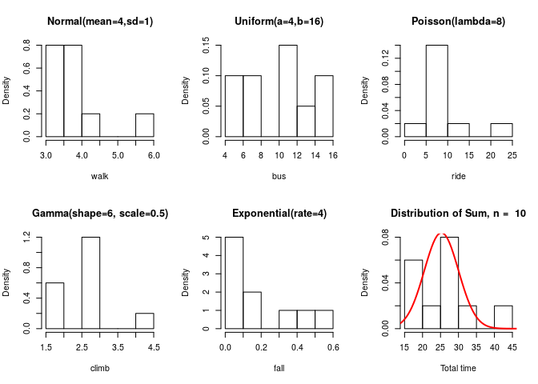
<p class="caption">(\#fig:n-10)CLT in Action with $n$ = 10</p>
</div>
<br>

## $n$ = 110

<div class="figure" style="text-align: center">
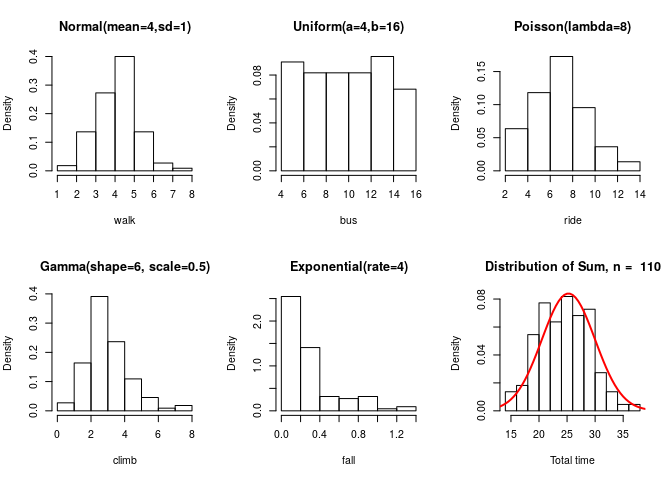
<p class="caption">(\#fig:n-110)CLT in Action with $n$ = 110</p>
</div>
<br>

## $n$ = 210

<div class="figure" style="text-align: center">
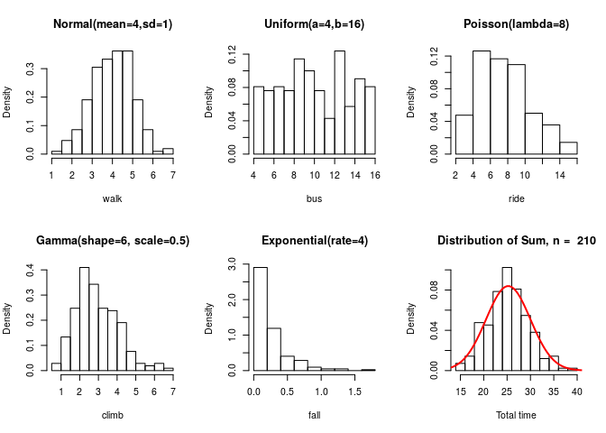
<p class="caption">(\#fig:n-210)CLT in Action with $n$ = 210</p>
</div>
<br>

## $n$ = 310

<div class="figure" style="text-align: center">
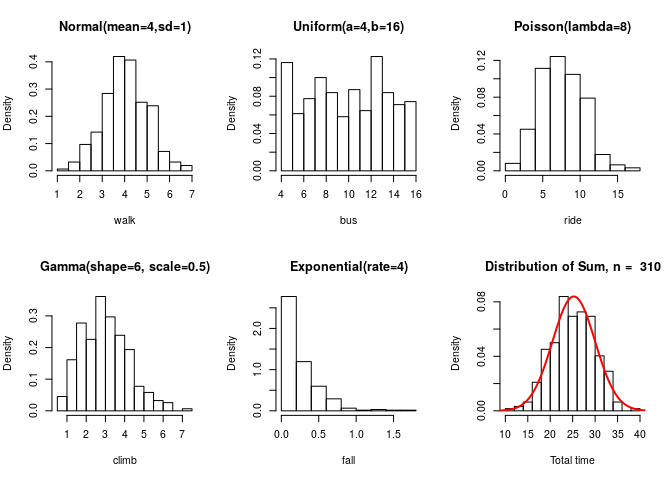
<p class="caption">(\#fig:n-310)CLT in Action with $n$ = 310</p>
</div>
<br>

## $n$ = 410

<div class="figure" style="text-align: center">
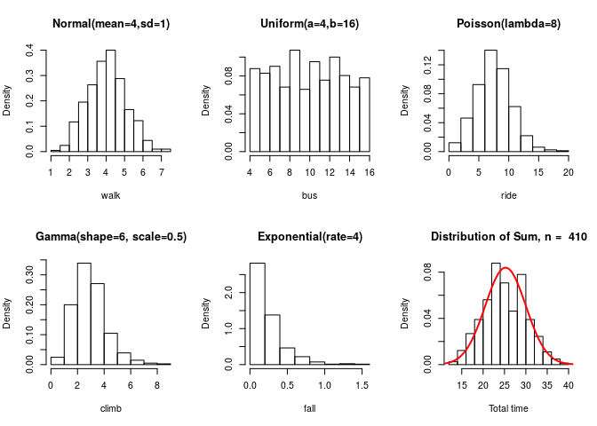
<p class="caption">(\#fig:n-410)CLT in Action with $n$ = 410</p>
</div>
<br>

## $n$ = 510

<div class="figure" style="text-align: center">
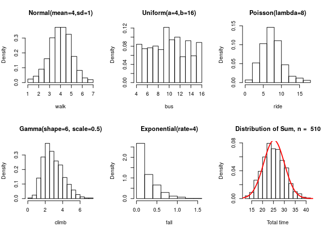
<p class="caption">(\#fig:n-510)CLT in Action with $n$ = 510</p>
</div>
<br>

## $n$ = 610

<div class="figure" style="text-align: center">
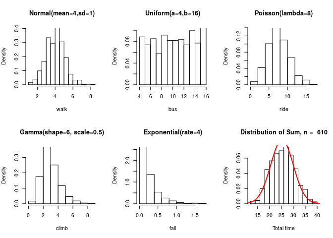
<p class="caption">(\#fig:n-610)CLT in Action with $n$ = 610</p>
</div>
<br>

## $n$ = 710

<div class="figure" style="text-align: center">
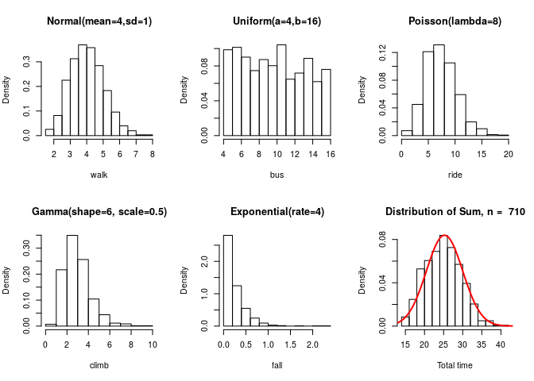
<p class="caption">(\#fig:n-710)CLT in Action with $n$ = 710</p>
</div>
<br>

## $n$ = 810

<div class="figure" style="text-align: center">
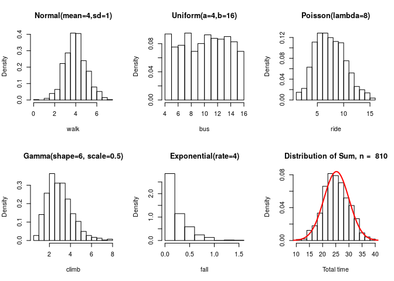
<p class="caption">(\#fig:n-810)CLT in Action with $n$ = 810</p>
</div>
<br>

## $n$ = 910

<div class="figure" style="text-align: center">
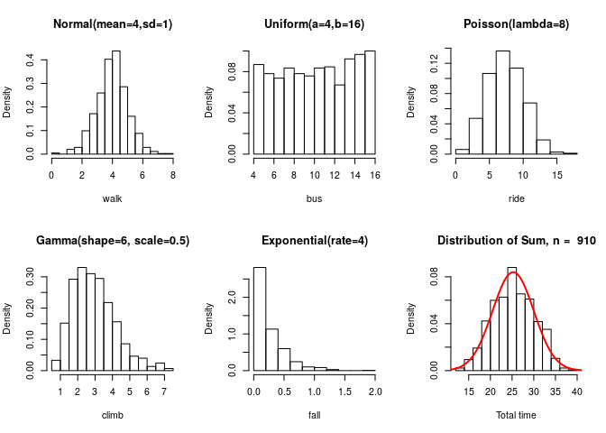
<p class="caption">(\#fig:n-910)CLT in Action with $n$ = 910</p>
</div>
<br>

## $n$ = 1010

<div class="figure" style="text-align: center">
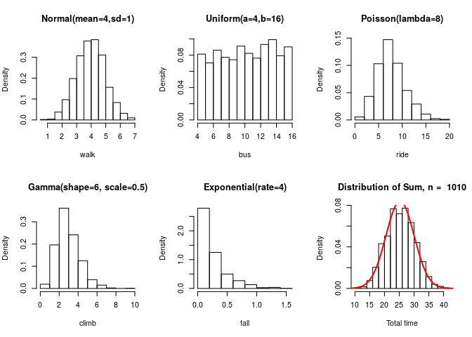
<p class="caption">(\#fig:n-1010)CLT in Action with $n$ = 1010</p>
</div>
<br>

## $n$ = 1110

<div class="figure" style="text-align: center">

<p class="caption">(\#fig:n-1110)CLT in Action with $n$ = 1110</p>
</div>
<br>

## $n$ = 1210

<div class="figure" style="text-align: center">
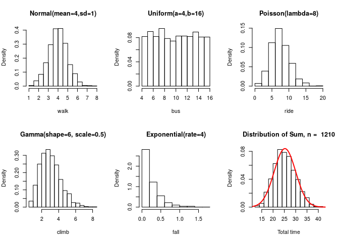
<p class="caption">(\#fig:n-1210)CLT in Action with $n$ = 1210</p>
</div>
<br>

## $n$ = 1310

<div class="figure" style="text-align: center">
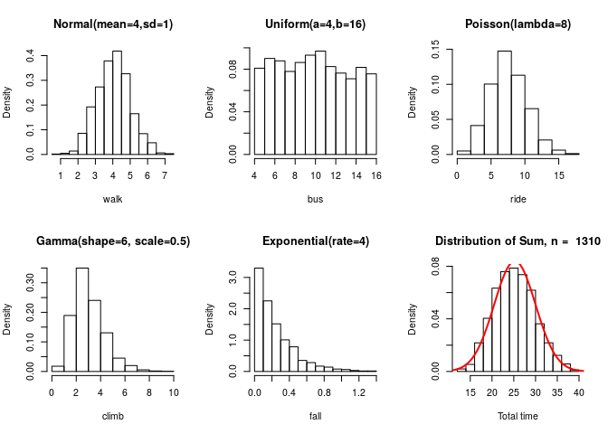
<p class="caption">(\#fig:n-1310)CLT in Action with $n$ = 1310</p>
</div>
<br>

## $n$ = 1410

<div class="figure" style="text-align: center">
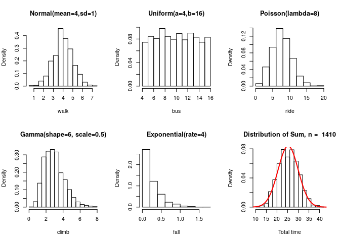
<p class="caption">(\#fig:n-1410)CLT in Action with $n$ = 1410</p>
</div>
<br>

## $n$ = 1510

<div class="figure" style="text-align: center">
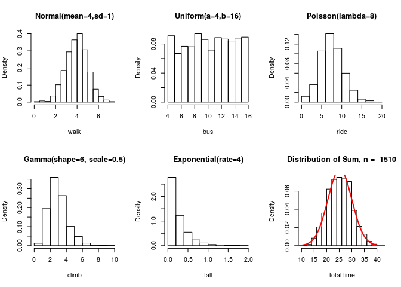
<p class="caption">(\#fig:n-1510)CLT in Action with $n$ = 1510</p>
</div>
<br>

## $n$ = 1610

<div class="figure" style="text-align: center">
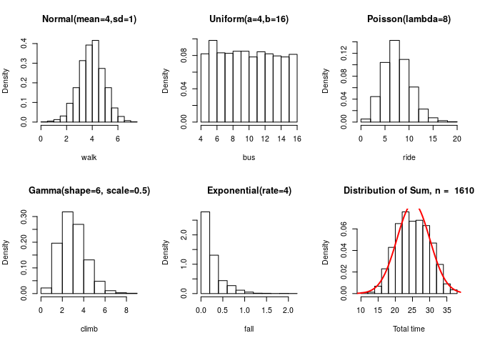
<p class="caption">(\#fig:n-1610)CLT in Action with $n$ = 1610</p>
</div>
<br>

## $n$ = 1710

<div class="figure" style="text-align: center">
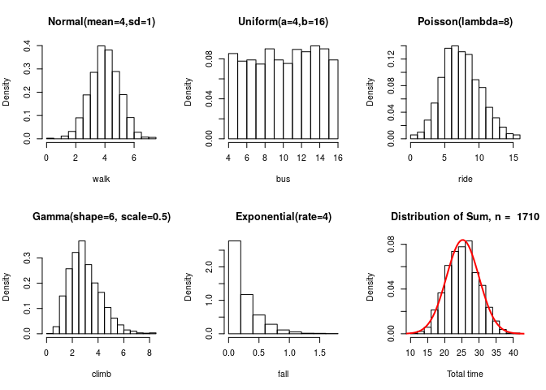
<p class="caption">(\#fig:n-1710)CLT in Action with $n$ = 1710</p>
</div>
<br>

## $n$ = 1810

<div class="figure" style="text-align: center">
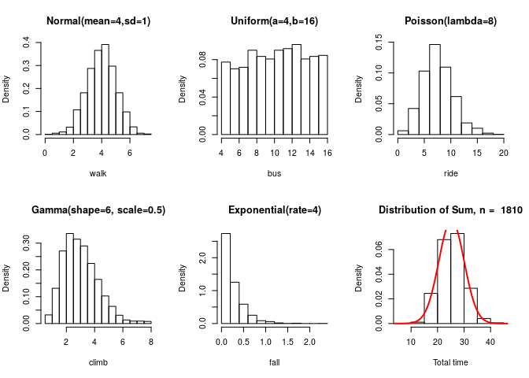
<p class="caption">(\#fig:n-1810)CLT in Action with $n$ = 1810</p>
</div>
<br>

## $n$ = 1910

<div class="figure" style="text-align: center">
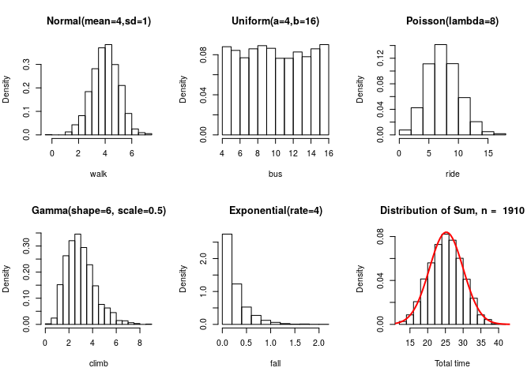
<p class="caption">(\#fig:n-1910)CLT in Action with $n$ = 1910</p>
</div>
<br>

## $n$ = 2010

<div class="figure" style="text-align: center">
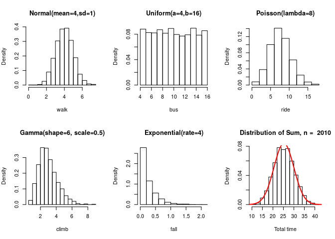
<p class="caption">(\#fig:n-2010)CLT in Action with $n$ = 2010</p>
</div>

<br>


# Code {-}


```r
if (!require("pacman")) install.packages("pacman")
pacman::p_load(knitr, here)  # needed for filepaths

options(width = 60, digits = 2)
set.seed(45)
opts_chunk$set(echo = FALSE, tidy = TRUE, cache = FALSE, warning = FALSE, 
    message = FALSE)
opts_template$set(fig.large = list(fig.width = 7, fig.height = 5, 
    fig.align = "center", fig.pos = "H"), fig.small = list(fig.width = 6, 
    fig.height = 4, fig.align = "center", fig.pos = "H"), fig.full = list(fig.width = 8, 
    fig.height = 6, fig.align = "center", fig.pos = "H"))
opts_knit$set(eval.after = "fig.cap")  # for captions to be evaluated after R objects are available 

knitr::read_chunk(here::here("R", "006-packages.R"))
knitr::include_graphics(path = here::here("clt.png"))
src <- mapply(knitr::knit_expand, file = here::here("Rmd", "006-CLT-template.Rmd"), 
    i = seq(10, 2010, by = 100))

somme <- 1:10
print(sessionInfo(), locale = FALSE)
if (!require("pacman")) install.packages("pacman")

pacman::p_load(knitr, here)
```

# Session Information


```
## R version 3.6.0 (2019-04-26)
## Platform: x86_64-pc-linux-gnu (64-bit)
## Running under: Pop!_OS 18.10
## 
## Matrix products: default
## BLAS:   /usr/lib/x86_64-linux-gnu/blas/libblas.so.3.8.0
## LAPACK: /usr/lib/x86_64-linux-gnu/lapack/liblapack.so.3.8.0
## 
## attached base packages:
## [1] stats     graphics  grDevices utils     datasets 
## [6] methods   base     
## 
## other attached packages:
## [1] here_0.1     knitr_1.22   pacman_0.5.0
## 
## loaded via a namespace (and not attached):
##  [1] Rcpp_1.0.1      bookdown_0.9    png_0.1-7      
##  [4] digest_0.6.18   rprojroot_1.3-2 backports_1.1.3
##  [7] formatR_1.6     magrittr_1.5    evaluate_0.13  
## [10] highr_0.8       stringi_1.4.3   rmarkdown_1.12 
## [13] tools_3.6.0     stringr_1.4.0   xfun_0.6       
## [16] yaml_2.2.0      compiler_3.6.0  htmltools_0.3.6
```


# References

